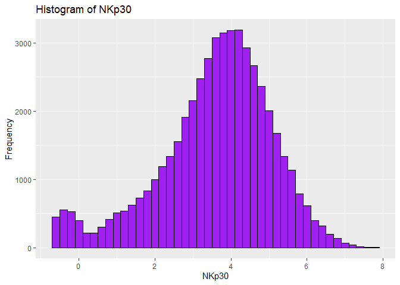

FA1 - Cuerdo, Naomi Hannah A.
================
Cuerdo, Naomi Hannah A.
2025-01-27

``` r
data <-read.csv("C:/Users/naomi/Downloads/cytof_one_experiment.csv")

str(data)
```

    ## 'data.frame':    50000 obs. of  35 variables:
    ##  $ NKp30        : num  0.188 1.035 3 4.3 -0.439 ...
    ##  $ KIR3DL1      : num  3.616 1.7 6.141 -0.221 -0.504 ...
    ##  $ NKp44        : num  -0.561 -0.289 1.903 0.243 -0.153 ...
    ##  $ KIR2DL1      : num  -0.294 -0.48 0.482 -0.483 0.751 ...
    ##  $ GranzymeB    : num  2.48 3.26 4.28 3.35 3.19 ...
    ##  $ CXCR6        : num  -0.1447 -0.0339 1.9465 0.9262 -0.0589 ...
    ##  $ CD161        : num  -0.315 -0.411 -0.502 3.877 1.091 ...
    ##  $ KIR2DS4      : num  1.945 3.8025 -0.3201 -0.1697 -0.0503 ...
    ##  $ NKp46        : num  4.082 3.734 4.559 4.483 0.838 ...
    ##  $ NKG2D        : num  2.62 -0.483 -0.507 1.927 -0.458 ...
    ##  $ NKG2C        : num  -0.357 -0.468 2.619 -0.311 0.922 ...
    ##  $ X2B4         : num  -0.271 -0.559 -0.455 1.635 1.242 ...
    ##  $ CD69         : num  3.85 2.91 3.11 3.05 2.64 ...
    ##  $ KIR3DL1.S1   : num  -0.255 -0.291 3.661 0.287 0.422 ...
    ##  $ CD2          : num  5.353 4.313 5.597 -0.5 -0.548 ...
    ##  $ KIR2DL5      : num  -0.509 3.777 0.813 0.361 1.064 ...
    ##  $ DNAM.1       : num  0.881 1.541 1.001 1.266 0.872 ...
    ##  $ CD4          : num  -0.3235 -0.1321 -0.5993 -0.1257 -0.0711 ...
    ##  $ CD8          : num  -0.282 0.916 1.838 0.767 -0.106 ...
    ##  $ CD57         : num  3.33 2.49 3.99 2 3.43 ...
    ##  $ TRAIL        : num  -0.608 -0.503 -0.275 -0.513 -0.143 ...
    ##  $ KIR3DL2      : num  -0.3067 -0.5432 2.0649 2.1125 -0.0251 ...
    ##  $ MIP1b        : num  1.25 2.87 4.1 3.37 -0.31 ...
    ##  $ CD107a       : num  -0.13 -0.189 -0.2 -0.572 -0.107 ...
    ##  $ GM.CSF       : num  -0.431 -0.163 3.189 0.913 -0.604 ...
    ##  $ CD16         : num  4 4.41 6 5.82 4.01 ...
    ##  $ TNFa         : num  0.9014 1.9359 -0.0234 -0.6079 -0.6199 ...
    ##  $ ILT2         : num  -0.386 2.9839 -0.5211 -0.0438 1.1827 ...
    ##  $ Perforin     : num  6.43 6.81 5.1 5.84 4.89 ...
    ##  $ KIR2DL2.L3.S2: num  1.2271 -0.0414 -0.1671 -0.5175 -0.3625 ...
    ##  $ KIR2DL3      : num  2.66066 3.8413 -0.00969 -0.59299 -0.39812 ...
    ##  $ NKG2A        : num  -0.522 4.677 -0.473 -0.406 -0.544 ...
    ##  $ NTB.A        : num  4.35 3.47 5.63 4.6 3.61 ...
    ##  $ CD56         : num  2.9 3.78 5.7 6.07 1.97 ...
    ##  $ INFg         : num  -0.384 2.719 2.532 2.456 3.147 ...

2.  Choose one of the columns of the dataset and make at least two plots
    showing its distribution (choose from ECDF, quantile, histogram,
    density estimate). What does the plot tell you about the
    distribution of the values in that column?

## Histogram

``` r
column <- "NKp30"
ggplot(data, aes(x = get(column))) + geom_histogram(binwidth = 0.2, fill = "purple", color = "black") +
  labs(title = paste("Histogram of", column), x = column, y = "Frequency")
```

<!-- -->

The histogram above shows the distribution of the column NKp30. The data
shows a roughly symmetric and bell-shaped pattern, which suggests a
near-normal distribution. Most of the values are concentrated around 4,
with the range extending from approximately 0 to 8. This indicates that
the majority of observations cluster in the middle, with fewer
occurrences at the extremes. The histogram provides an initial
understanding of the spread and the central tendency of the NKp30 values
in the data set.

## Density Plot

``` r
ggplot(data, aes(x = get(column))) + geom_density(fill = "red", alpha = 0.5) + labs(title = paste("Density of", column), x = column, y = "Frequency")
```

<!-- -->

The Density Plot above shows the distribution of the NKp30. This figure
confirms that the values are concentrated around 4, where the density
reaches it peak, indicating the most frequent values. The distribution
appears to be unimodal, with a single prominent peak, and a gradual
tapering towards the lower and higher ends. The density plot provides a
more clearer view of the data’s distribution compared to the histogram,
suggesting a continuous nature and a near-normal distribution.

3.  Choose any two of the columns of the data set and make a Q-Q plot
    comparing the distributions. What does the Q-Q plot tell you about
    similarities or differences between the distributions of the values
    in the two columns?

## Q-Q Plot

``` r
column1 <- "NKp30"
column2 <- "CD4"

qqplot <- ggplot(data, aes(sample = get(column1))) + stat_qq(aes(sample = get(column2))) + stat_qq_line() + labs(title = paste("Q-Q Plot:", column1, "vs", column2), x = column1, y = column2)

print(qqplot)
```

<!-- -->

The Q-Q Plot above compares the distributions of two data sets: NKp30
(x-axis) and CD4 (y-axis). The points differ significantly from the
diagonal reference line, indicating that the distributions of NKp30 and
CD4 differ in shape. The curve present above suggests that CD4 values
are more heavily skewed compared to NKp30.The deviation at the ends show
that the extreme values differ between the two data sets: CD4 has
heavier tails, especially in the positive direction. The non-linear
pattern suggests one data set may not be symmetric, which may be CD4,
possibly having a positive skew.

Overall, the distributions of NKp30 and CD4 differ substantially in
shape and tail behavior, indicating that they do not follow the same
underlying distribution.

## APA Report

This report examines the distribution of the NKp30 column in a CyTOF
data set through graphical representations. These report provides
insights into the nature of the data distribution and its potential
implication.

The data was imported into R for analysis. The NKp30 was selected, and
both a histogram and a density plot were generated to visualize its
distribution, and a Q-Q plot was created to compare the distributions of
NKp30 and CD4.

### Results

**Histogram of NKp30**

The histogram displays the frequency distribution of the values in the
NKp30 value. The shape is approximately bell-shaped, which suggests a
near-normal distribution. Most of the values are concentrated around 4,
with the range extending from approximately 0 to 8. This indicates that
the majority of observations cluster in the middle, with fewer
occurrences at the extremes.

**Density Plot of NKp30**

The density plot provides a smooth representation of the NKp30 valies.
The peak density occurs around 4, which appears to be unimodal but
slightly skewed, with a minor secondary peak at 0, suggesting a subset
of values distinct from the main distribution.

**Quantile-Quantile (Q-Q) Plot**

A Q-Q plot was generated to compare the distributions of NKp30 and CD4
columns. The plot indicates whether the two columns have a similar
distribution. Results show that the points align closely to the diagonal
line, indicating that they have comparable distributions. However,
deviations at the ends imply differences in the extreme values,
suggesting variations in their distributions.
