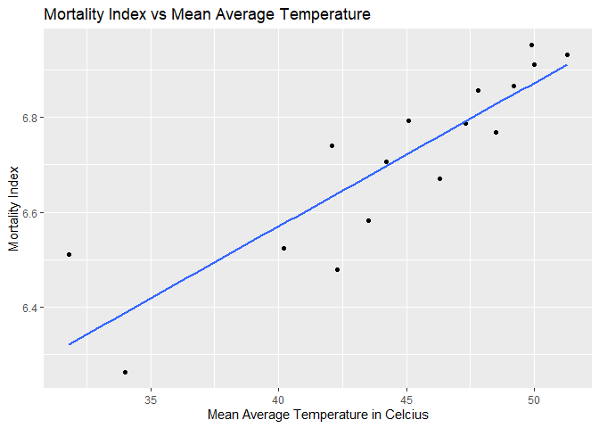
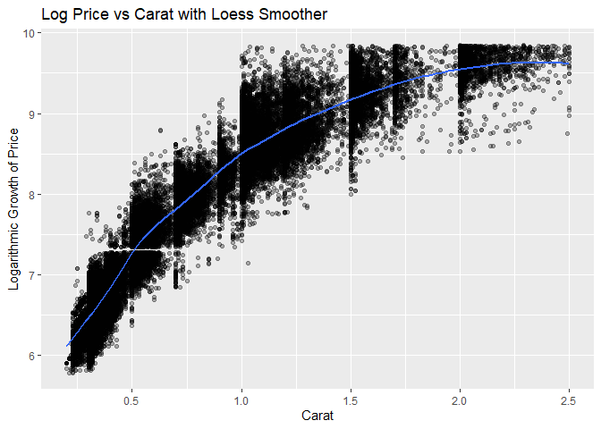
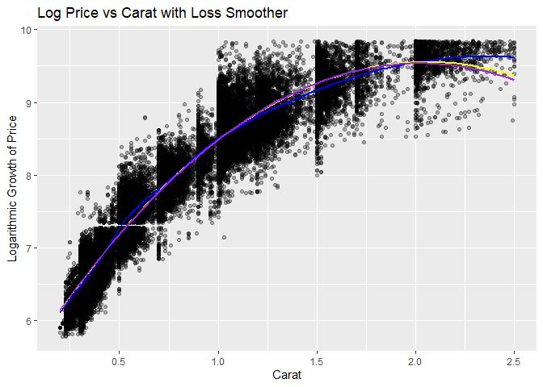
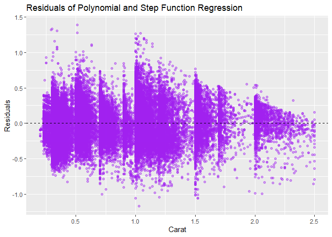
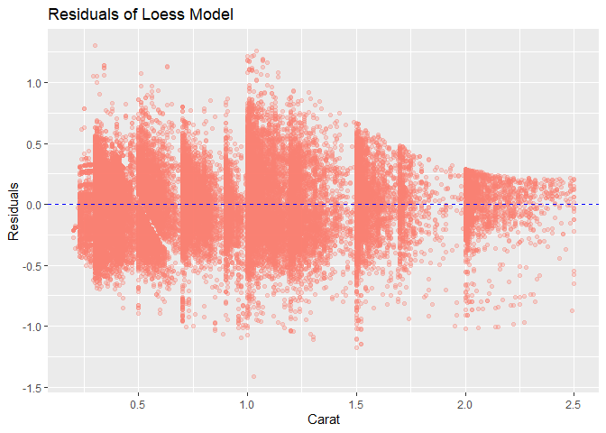

FA4_Cuerdo, Naomi Hannah A.
================
Cuerdo, Naomi Hannah A.
2025-03-01

# Mortality by Latitude

## 1 Import Data

``` r
data <- read.csv("C:/Users/naomi/Downloads/mortality_by_latitude.csv")

data
```

    ##    latitude mortality_index temperature
    ## 1        50            1025        51.3
    ## 2        51            1045        49.9
    ## 3        52            1004        50.0
    ## 4        53             959        49.2
    ## 5        54             870        48.5
    ## 6        55             950        47.8
    ## 7        56             886        47.3
    ## 8        57             892        45.1
    ## 9        58             789        46.3
    ## 10       59             846        42.1
    ## 11       60             817        44.2
    ## 12       61             722        43.5
    ## 13       62             651        42.3
    ## 14       63             681        40.2
    ## 15       69             673        31.8
    ## 16       70             525        34.0

## 1.1 Make a plot of mortality index against mean average temperature.

``` r
data %>% ggplot(
  mapping = aes(
    x = temperature, y = mortality_index
  )
) +
geom_point() +
  geom_smooth(
    method = "lm", se = FALSE
  ) + labs (
    title = "Mortality Index vs Mean Average Temperature",
    x = "Mean Average Temperature in Celcius",
    y = "Mortality Index"
  )
```

    ## `geom_smooth()` using formula = 'y ~ x'

<!-- -->

#### 1.1.1 Is it hollow up or hollow down?

Based from the plot above, the blue line has a trend that is going
upward. Hence, the relationship between the average temperature and
mortality index hollows up.

#### 1.1.2 Transformation to Straighten Out the Relationship

``` r
data %>% ggplot(
  mapping = aes(
    x = temperature, y = log(mortality_index)
  )
) +
geom_point() +
  geom_smooth(
    method = "lm", se = FALSE
  ) + labs (
    title = "Mortality Index vs Mean Average Temperature",
    x = "Mean Average Temperature in Celcius",
    y = "Mortality Index"
  )
```

    ## `geom_smooth()` using formula = 'y ~ x'

<!-- -->

#### Checking residual remains using log(mortality_index)

``` r
residuals <- resid(
  lm(
    log(
      mortality_index
    ) ~ temperature,
    data = data
  )
)
```

##### Plotting the residuals

``` r
data %>% ggplot(
  mapping = aes(
    x = temperature, y = residuals
  )
) +
geom_point() +
  geom_hline(
    yintercept = 0.00, linetype = "dashed"
  ) + labs (
    title = "Residuals of Log Mortality Index vs Mean Average Temperature",
    x = "Average Temperature in Celcius",
    y = "Residuals"
  )
```

<!-- -->

From the plot above, it shows that as the average temperature increases,
the trend witht the mortality index became more fitting to the trend
line, and the missing points are less evident.

# Diamond Dataset

``` r
data("diamonds")
```

### 2.1 Plot of Log Price as a Function of Carat with a Loess Smoother

``` r
diamonds %>%
  filter(carat <= 2.50
    # Use the value `5.00` if none entries shall be filtered out
  ) %>%
  ggplot(
    mapping = aes(
      x = carat, y = log(price)
    )
  ) +
  geom_point(
    alpha = 0.3
  ) +
  geom_smooth(
    method = "loess", span = 0.5, se = FALSE
  ) +
  labs(title = "Log Price vs Carat with Loess Smoother",
       x = "Carat",
       y = "Logarithmic Growth of Price")
```

    ## `geom_smooth()` using formula = 'y ~ x'

<!-- -->

### 2.2 Trying values for Span and Degree values

``` r
diamonds %>%
  filter(carat <= 2.50
  ) %>%
  ggplot(
    mapping = aes(
      x = carat, y = log(price)
    )
  ) +
  geom_point(
    alpha = 0.3
  ) +
  geom_smooth(
    method = "loess", span = 0.5, se = FALSE, color = "blue"
  ) +
  geom_smooth(
    method = "loess", span = 1.5, se = FALSE, color = "yellow"
  ) +
  geom_smooth(
    method = "loess", span = 2.5, se = FALSE, color = "purple"
  ) +
  
  labs(title = "Log Price vs Carat with Loss Smoother",
       x = "Carat",
       y = "Logarithmic Growth of Price")
```

    ## `geom_smooth()` using formula = 'y ~ x'
    ## `geom_smooth()` using formula = 'y ~ x'
    ## `geom_smooth()` using formula = 'y ~ x'

<!-- -->

From the plot, the blue curve with a span of 0.5 follows the data more
closely, which can be useful for capturing detailed trends but it might
overfit. The yellow span smooths out fluctuations, capturing the overall
trend. The purple curve is too rigid and does not cover important
variations.

Thus, a span around **1.0 to 1.5**\* is a good balance between capturing
the trend and avoid overfitting.

### 3.1 Comparing Loess Smoother to Polynomial and Step Function Regression

#### 3.1.1 Polynomial + Step Function Regression

``` r
diamonds_subset <- diamonds %>%
  filter(carat <= 2.50)

poly_model <- lm(log(price)~ poly(carat, 3) + cut, data = diamonds_subset)

residuals_poly <- resid(poly_model)

ggplot(diamonds_subset, aes(x = carat, y =residuals_poly)) +
  geom_point(alpha = 0.4, color = "purple") +
  geom_hline(yintercept = 0, linetype = "dashed", color = "black") +
  labs(title = "Residuals of Polynomial and Step Function Regression", 
       x = "Carat",
       y = "Residuals")
```

<!-- -->

#### 3.1.2 Plotting resdiuals for loess model

``` r
loess_model <- loess(log(price) ~ carat, data = diamonds_subset, span = 0.5)

residual_loess <- residuals(loess_model)

ggplot(diamonds_subset, aes(x = carat, y = residual_loess)) +
  geom_point(alpha = 0.3, color = "salmon") +
  geom_hline(yintercept = 0, linetype = "dashed", color = "blue") +
  labs(title = "Residuals of Loess Model", 
       x = "Carat",
       y = "Residuals")
```

<!-- -->

#### Which plot is more faithful?

The 3.1.2 Residual of Loess Model is more faithful compared to the
Residuals of Polynomial and Step Function Regression as it captures the
non-linear trends better, and has smaller residuals.
