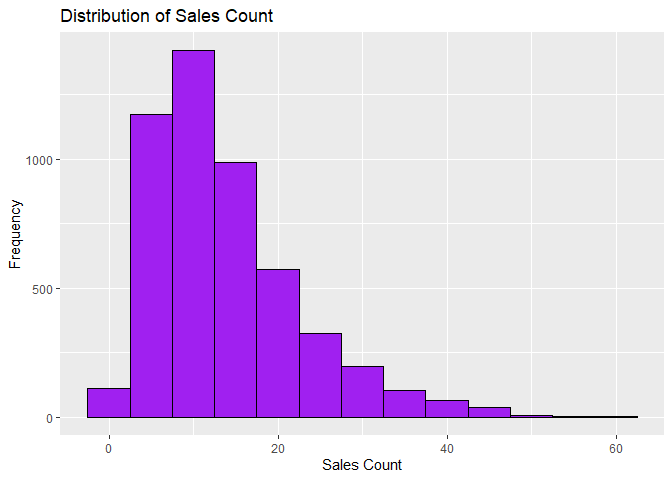
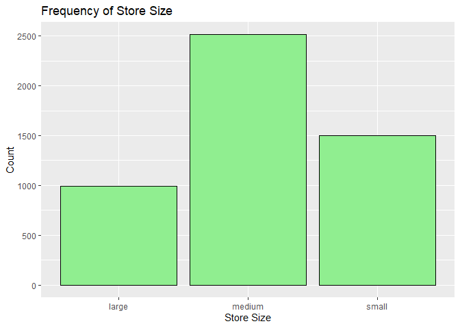

FA 5
================
Cuerdo, Naomi Hannah A.
2025-04-26

# Poisson Regression with Store Sales Data

## Load and Explore the Data

Loading the dataset:

``` r
glimpse(storeSales)
```

    ## Rows: 5,000
    ## Columns: 5
    ## $ day_of_week <int> 6, 3, 4, 6, 2, 4, 4, 6, 1, 2, 6, 2, 2, 4, 3, 2, 5, 4, 1, 3…
    ## $ promo       <int> 0, 0, 0, 1, 0, 0, 0, 1, 1, 1, 1, 0, 1, 1, 0, 1, 0, 0, 0, 0…
    ## $ holiday     <int> 0, 0, 0, 0, 0, 1, 0, 0, 0, 0, 0, 0, 0, 0, 0, 0, 0, 0, 0, 0…
    ## $ store_size  <chr> "medium", "medium", "large", "small", "medium", "medium", …
    ## $ sales_count <int> 18, 13, 24, 16, 11, 13, 12, 34, 19, 8, 22, 10, 22, 9, 3, 1…

``` r
summary(storeSales)
```

    ##   day_of_week        promo           holiday        store_size       
    ##  Min.   :0.000   Min.   :0.0000   Min.   :0.0000   Length:5000       
    ##  1st Qu.:1.000   1st Qu.:0.0000   1st Qu.:0.0000   Class :character  
    ##  Median :3.000   Median :0.0000   Median :0.0000   Mode  :character  
    ##  Mean   :2.985   Mean   :0.3012   Mean   :0.0956                     
    ##  3rd Qu.:5.000   3rd Qu.:1.0000   3rd Qu.:0.0000                     
    ##  Max.   :6.000   Max.   :1.0000   Max.   :1.0000                     
    ##   sales_count   
    ##  Min.   : 0.00  
    ##  1st Qu.: 7.00  
    ##  Median :12.00  
    ##  Mean   :13.73  
    ##  3rd Qu.:18.00  
    ##  Max.   :61.00

``` r
head(storeSales)
```

    ##   day_of_week promo holiday store_size sales_count
    ## 1           6     0       0     medium          18
    ## 2           3     0       0     medium          13
    ## 3           4     0       0      large          24
    ## 4           6     1       0      small          16
    ## 5           2     0       0     medium          11
    ## 6           4     0       1     medium          13

#### Distribution of sales_count:

``` r
ggplot(storeSales, aes(x= sales_count)) +
  geom_histogram(binwidth = 5, fill = "purple", color = "black") +
  labs(title = "Distribution of Sales Count", x = "Sales Count", y = "Frequency")
```

<!-- -->

#### Frequency of each store_size:

``` r
ggplot(storeSales, aes(x= store_size)) +
  geom_bar(fill = "lightgreen", color = "black") +
  labs(title = "Frequency of Store Size", x = "Store Size", y = "Count")
```

<!-- -->

#### Proportion of days with promo and holiday

``` r
storeSales %>%
  count(promo) %>%
  mutate(proportion = n / sum(n))
```

    ##   promo    n proportion
    ## 1     0 3494     0.6988
    ## 2     1 1506     0.3012

``` r
storeSales %>%
  count(holiday) %>%
  mutate(proportion = n / sum(n))
```

    ##   holiday    n proportion
    ## 1       0 4522     0.9044
    ## 2       1  478     0.0956

## Fit a Poisson Regression Model

``` r
poisson_model <- glm(
  sales_count ~ day_of_week + promo + holiday + store_size,
  family = poisson(link = "log"),
  data = storeSales
)

summary(poisson_model)
```

    ## 
    ## Call:
    ## glm(formula = sales_count ~ day_of_week + promo + holiday + store_size, 
    ##     family = poisson(link = "log"), data = storeSales)
    ## 
    ## Coefficients:
    ##                   Estimate Std. Error z value Pr(>|z|)    
    ## (Intercept)       2.994849   0.009422  317.86   <2e-16 ***
    ## day_of_week       0.051115   0.001918   26.65   <2e-16 ***
    ## promo             0.410843   0.007817   52.55   <2e-16 ***
    ## holiday          -0.330938   0.014935  -22.16   <2e-16 ***
    ## store_sizemedium -0.697088   0.008296  -84.03   <2e-16 ***
    ## store_sizesmall  -1.395564   0.011868 -117.59   <2e-16 ***
    ## ---
    ## Signif. codes:  0 '***' 0.001 '**' 0.01 '*' 0.05 '.' 0.1 ' ' 1
    ## 
    ## (Dispersion parameter for poisson family taken to be 1)
    ## 
    ##     Null deviance: 25307.2  on 4999  degrees of freedom
    ## Residual deviance:  5142.7  on 4994  degrees of freedom
    ## AIC: 26507
    ## 
    ## Number of Fisher Scoring iterations: 4

Interpreting the effect of promotion to the store’s sales:

``` r
exp(coef(poisson_model)["promo"])
```

    ##    promo 
    ## 1.508089

As the promo increases, the number of sales also increases.

Interpreting how store size affecs expected sales:

``` r
exp(coef(poisson_model)[grep("store_size", names(coef(poisson_model)))])
```

    ## store_sizemedium  store_sizesmall 
    ##        0.4980335        0.2476932

With a value of **0.498**, A **medium store** has about 50% the expected
sales of a large store, while a **small store with a value of 0.25** has
the expected sales of a large store.

## Assess Model

Checking for overdispersion:

``` r
deviance(poisson_model) / df.residual(poisson_model)
```

    ## [1] 1.029785

Since the deviance is close to 1, there is no significant overdispersion
which means that the poisson model is appropriate.

## Make Predictions

Predicting sales on a **medium store on a monday** with a **promotion
and a holiday** and a **large store on a sunday**

``` r
new_data <- tibble(
  day_of_week = c(1, 7),
  promo = c(1, 0),
  holiday = c(0, 1), 
  store_size = c("medium", "large")
)

predicted_sales <- predict(poisson_model, newdata = new_data, type = "response")

predicted_sales
```

    ##        1        2 
    ## 15.79542 20.52657

From the prediction model, we can say that the medium store is expected
to sell at about 16 items with a promo on a normal day, meanwhile the
large store is expected to sell at about 21 items on a holiday without a
promo.

From here, we can say that large stores can still outperform medium
stores even without a promo.

## Reflection

The Poisson regression model seems to fit the data well, with a
deviance-to-degrees-of-freedom ratio close to 1.03, suggesting no large
overdispersion. Among the predictors, store size had the most effect in
sales, with small and medium stores showing lower expected sales
compared to large stores. Promotions also positively influenced sales,
but to a lesser extent, since large stores can still outperform small
and medium stores even without a holiday.

However, one limitation of this model is that it assumes that the
relationship between the predictors and sales is consistent across all
levels where in reality, external factors may affect sales such as
seasonal trends, competitor actions, and economic factors, in which all
of these were not captured in this model. Incorporating these factorrs
might improve predictive models that can fit in a real-world setting.
