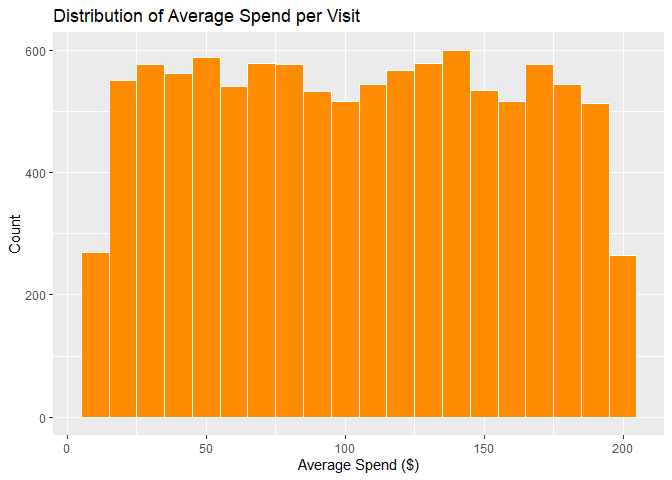

FA 6
================
Cuerdo, Naomi Hannah A.
2025-05-04

# Customer Segmentation in an E-Commerce Business

## Introduction

This analysis focused on building a multinomial logistic regression
model to predict customer segment based on demographic and purchase
behavior data.

#### Data Exploration

``` r
glimpse(df)
```

    ## Rows: 10,532
    ## Columns: 8
    ## $ `Customer ID`                       <dbl> 1, 2, 3, 4, 5, 6, 7, 8, 9, 10, 11,…
    ## $ Age                                 <dbl> 56, 69, 46, 32, 60, 25, 38, 56, 36…
    ## $ `Annual Income (K$)`                <dbl> 106, 66, 110, 50, 73, 48, 100, 131…
    ## $ Gender                              <chr> "Female", "Female", "Male", "Male"…
    ## $ `Product Category Purchased`        <chr> "Fashion", "Home", "Fashion", "Ele…
    ## $ `Average Spend per Visit ($)`       <dbl> 163.45276, 163.02050, 104.54128, 1…
    ## $ `Number of Visits in Last 6 Months` <dbl> 16, 31, 29, 26, 38, 22, 20, 33, 34…
    ## $ `Customer Segment`                  <chr> "Premium Shopper", "Budget Shopper…

``` r
colSums(is.na(df))
```

    ##                       Customer ID                               Age 
    ##                                 0                                 0 
    ##                Annual Income (K$)                            Gender 
    ##                                 0                                 0 
    ##        Product Category Purchased       Average Spend per Visit ($) 
    ##                                 0                                 0 
    ## Number of Visits in Last 6 Months                  Customer Segment 
    ##                                 0                                 0

There are no missing values in the dataset, thus we can proceed with the
visualization.

##### Age Distribution

``` r
ggplot(df, aes(x=Age)) +
  geom_histogram(binwidth = 5, fill = "steelblue", color = "white") +
  labs(title = "Distribution of Age", x = "Age", y = "Count")
```

<!-- -->

From the plot above, it has be seen that highest number of customers are
at around ages 40 years old.

##### Distribution of Annual Income

``` r
ggplot(df, aes(x=`Annual Income (K$)`)) +
  geom_histogram(binwidth = 5, fill = "darkgreen", color = "white") +
  labs(title = "Distribution of Annual Income", x = "Annual Income", y = "Count")
```

<!-- -->

##### Distribution of Average Spend per Visit

``` r
ggplot(df, aes(x = `Average Spend per Visit ($)`)) +
  geom_histogram(binwidth = 10, fill = "darkorange", color = "white") +
  labs(title = "Distribution of Average Spend per Visit", x = "Average Spend ($)", y = "Count")
```

<!-- -->

``` r
ggplot(df, aes(x = `Customer Segment`, fill = `Customer Segment`)) +
  geom_bar() +
  labs(title = "Customer Segment Distribution", x = "Segment", y = "Count") +
  theme_minimal()
```

<!-- -->

#### Data Preprocessing

##### Encoding gender to numeric

``` r
df$Gender <- ifelse(df$Gender == "Male", 1, 0)
```

##### One-Hot Encoding for the product category

``` r
df <- df%>%
  mutate(`Product Category Purchased` = as.factor(`Product Category Purchased`)) %>%
  tidyr::pivot_wider(
    names_from = `Product Category Purchased`,
    values_from = `Product Category Purchased`,
    values_fn = length,
    values_fill = 0
  )
```

##### Scale Numeric Variables

``` r
df_scaled <- df %>%
  mutate(
    Age = scale(Age),
    `Annual Income (K$)` = scale(`Annual Income (K$)`),
    `Average Spend per Visit ($)` = scale(`Average Spend per Visit ($)`)
  )
```

##### Convert Target Variable to Factor

``` r
df_scaled$`Customer Segment` <- as.factor(df_scaled$`Customer Segment`)
```

##### Split into Training and Test Sets

``` r
set.seed(123) 
train_index <- createDataPartition(df_scaled$`Customer Segment`, p = 0.8, list = FALSE)

train_data <- df_scaled[train_index, ]
test_data  <- df_scaled[-train_index, ]
```

##### Model Building

``` r
model <- multinom(`Customer Segment` ~ ., data = train_data)
```

    ## # weights:  39 (24 variable)
    ## initial  value 9258.005757 
    ## iter  10 value 9253.002577
    ## iter  20 value 9249.273522
    ## final  value 9248.931418 
    ## converged

``` r
summary(model)
```

    ## Call:
    ## multinom(formula = `Customer Segment` ~ ., data = train_data)
    ## 
    ## Coefficients:
    ##                 (Intercept) `Customer ID`        Age `Annual Income (K$)`
    ## Premium Shopper  0.05884859 -2.724024e-06 0.01622848          -0.02799553
    ## Regular Shopper  0.05944282 -3.175381e-06 0.01033032          -0.03992464
    ##                      Gender `Average Spend per Visit ($)`
    ## Premium Shopper -0.03718886                   -0.01397102
    ## Regular Shopper -0.06187535                   -0.03680408
    ##                 `Number of Visits in Last 6 Months`    Fashion       Home
    ## Premium Shopper                       -0.0020453883 0.13159286 0.02319590
    ## Regular Shopper                       -0.0008337835 0.07463887 0.01128578
    ##                 Electronics     Others      Books
    ## Premium Shopper 0.001683397 0.01586643 -0.1134900
    ## Regular Shopper 0.019854443 0.06882157 -0.1151578
    ## 
    ## Std. Errors:
    ##                  (Intercept) `Customer ID`        Age `Annual Income (K$)`
    ## Premium Shopper 0.0001801517  7.085075e-06 0.01327365           0.01332889
    ## Regular Shopper 0.0001792607  7.069207e-06 0.01336463           0.01341919
    ##                       Gender `Average Spend per Visit ($)`
    ## Premium Shopper 0.0001242479                    0.01331658
    ## Regular Shopper 0.0001169646                    0.01340279
    ##                 `Number of Visits in Last 6 Months`      Fashion         Home
    ## Premium Shopper                         0.001787296 0.0001407795 8.002041e-05
    ## Regular Shopper                         0.001778354 0.0001384202 8.232698e-05
    ##                  Electronics       Others        Books
    ## Premium Shopper 0.0001306963 1.713746e-05 0.0001904772
    ## Regular Shopper 0.0001312811 1.763691e-05 0.0001895931
    ## 
    ## Residual Deviance: 18497.86 
    ## AIC: 18541.86

The multinomial logistic regression predicts customer segments using
demographic and behavioral data. The fashion products strongly increase
odds of being Premium or Regular, while books are strongly Females are
more likely to be a Premium shopper rather than a regular shopper.
Meanwhile older customers are slightly more likely to be Premium. Annual
Income has a negative effect, in which there is a need for dat scaling.

Residual Deviance: 18, 497.86 AIC: 18,541.86

##### Tuning hyperparameters using cross-validation:

``` r
y <- as.factor(train_data$`Customer Segment`)
x <- model.matrix(`Customer Segment` ~ . - 1, data = train_data)

# test matrices

x_test <- model.matrix(`Customer Segment` ~ . - 1, data = test_data)
y_test <- as.factor(test_data$`Customer Segment`)

cv_model <- cv.glmnet(
  x, y, 
  family = "multinomial",
  type.measure = "class",
  alpha = 0,  # ridge regression (L2), set alpha = 1 for LASSO
  nfolds = 5
)

# Plot cross-validation curve
plot(cv_model)
```

<!-- -->

``` r
# Best lambda
best_lambda <- cv_model$lambda.min
print(best_lambda)
```

    ## [1] 13.96185

``` r
final_model <- glmnet(
  x, y,
  family = "multinomial",
  alpha = 0,
  lambda = best_lambda
)
```

#### Model Evaluation

``` r
predictions <- predict(final_model, newx = x_test, type = "class")
```

``` r
conf_mat <- confusionMatrix(factor(predictions), y_test)
```

    ## Warning in levels(reference) != levels(data): longer object length is not a
    ## multiple of shorter object length

    ## Warning in confusionMatrix.default(factor(predictions), y_test): Levels are not
    ## in the same order for reference and data. Refactoring data to match.

``` r
conf_mat
```

    ## Confusion Matrix and Statistics
    ## 
    ##                  Reference
    ## Prediction        Budget Shopper Premium Shopper Regular Shopper
    ##   Budget Shopper              28              25              26
    ##   Premium Shopper              0               0               0
    ##   Regular Shopper            675             671             680
    ## 
    ## Overall Statistics
    ##                                          
    ##                Accuracy : 0.3363         
    ##                  95% CI : (0.3162, 0.357)
    ##     No Information Rate : 0.3354         
    ##     P-Value [Acc > NIR] : 0.4714         
    ##                                          
    ##                   Kappa : 0.0015         
    ##                                          
    ##  Mcnemar's Test P-Value : <2e-16         
    ## 
    ## Statistics by Class:
    ## 
    ##                      Class: Budget Shopper Class: Premium Shopper
    ## Sensitivity                        0.03983                 0.0000
    ## Specificity                        0.96362                 1.0000
    ## Pos Pred Value                     0.35443                    NaN
    ## Neg Pred Value                     0.66683                 0.6694
    ## Prevalence                         0.33397                 0.3306
    ## Detection Rate                     0.01330                 0.0000
    ## Detection Prevalence               0.03753                 0.0000
    ## Balanced Accuracy                  0.50173                 0.5000
    ##                      Class: Regular Shopper
    ## Sensitivity                         0.96317
    ## Specificity                         0.03788
    ## Pos Pred Value                      0.33564
    ## Neg Pred Value                      0.67089
    ## Prevalence                          0.33539
    ## Detection Rate                      0.32304
    ## Detection Prevalence                0.96247
    ## Balanced Accuracy                   0.50053

``` r
accuracy <- conf_mat$overall["Accuracy"]
precision <- conf_mat$byClass[, "Pos Pred Value"]
recall <- conf_mat$byClass[, "Sensitivity"]
f1_score <- 2 * (precision * recall) / (precision + recall)


cat("Accuracy:", round(accuracy, 4), "\n")
```

    ## Accuracy: 0.3363

``` r
cat("Precision (per class):\n"); print(round(precision, 4))
```

    ## Precision (per class):

    ##  Class: Budget Shopper Class: Premium Shopper Class: Regular Shopper 
    ##                 0.3544                    NaN                 0.3356

``` r
cat("Recall (per class):\n"); print(round(recall, 4))
```

    ## Recall (per class):

    ##  Class: Budget Shopper Class: Premium Shopper Class: Regular Shopper 
    ##                 0.0398                 0.0000                 0.9632

``` r
cat("F1-Score (per class):\n"); print(round(f1_score, 4))
```

    ## F1-Score (per class):

    ##  Class: Budget Shopper Class: Premium Shopper Class: Regular Shopper 
    ##                 0.0716                    NaN                 0.4978

Based from the numbers, The model struggles to distinguish customer
segments clearly. Predictions are biased toward the most common class,
and none of the groups are predicted reliably.

##### Refinement

``` r
df_scaled <- df_scaled %>%
  mutate(
    Income_Age_Interaction = scale(`Annual Income (K$)` * Age)
  )
set.seed(123)
train_index <- createDataPartition(df_scaled$`Customer Segment`, p = 0.8, list = FALSE)
train_data <- df_scaled[train_index, ]
test_data <- df_scaled[-train_index, ]

x_train <- model.matrix(`Customer Segment` ~ . -1, data = train_data)
y_train <- as.factor(train_data$`Customer Segment`)
x_test <- model.matrix(`Customer Segment` ~ . -1, data = test_data)
y_test <- as.factor(test_data$`Customer Segment`)

alphas <- seq(0, 1, by = 0.2)  # From Ridge (0) to LASSO (1)
cv_results <- list()

for (a in alphas) {
  cat("Fitting model with alpha =", a, "\n")
  cv_fit <- cv.glmnet(
    x_train, y_train,
    family = "multinomial",
    type.measure = "class",
    alpha = a,
    nfolds = 5
  )
  cv_results[[paste0("alpha_", a)]] <- cv_fit
}
```

    ## Fitting model with alpha = 0 
    ## Fitting model with alpha = 0.2 
    ## Fitting model with alpha = 0.4 
    ## Fitting model with alpha = 0.6 
    ## Fitting model with alpha = 0.8 
    ## Fitting model with alpha = 1

``` r
best_model <- NULL
lowest_error <- Inf
best_alpha <- NA

for (a in names(cv_results)) {
  err <- min(cv_results[[a]]$cvm)
  if (err < lowest_error) {
    lowest_error <- err
    best_model <- cv_results[[a]]
    best_alpha <- as.numeric(gsub("alpha_", "", a))
  }
}

cat("Best alpha:", best_alpha, "\n")
```

    ## Best alpha: 0.6

``` r
best_lambda <- best_model$lambda.min
```

``` r
final_model <- glmnet(
  x_train, y_train,
  family = "multinomial",
  lambda = best_lambda
)
```

Evaluating with Cross-Validation:

``` r
cv_fit <- train(
  x = x_train, y = y_train,
  method = "glmnet",
  family = "multinomial",
  trControl = trainControl(method = "cv", number = 10),
  tuneGrid = expand.grid(alpha = best_alpha, lambda = best_lambda)
)
print(cv_fit)
```

    ## glmnet 
    ## 
    ## 8427 samples
    ##   12 predictor
    ##    3 classes: 'Budget Shopper', 'Premium Shopper', 'Regular Shopper' 
    ## 
    ## No pre-processing
    ## Resampling: Cross-Validated (10 fold) 
    ## Summary of sample sizes: 7584, 7583, 7584, 7583, 7584, 7585, ... 
    ## Resampling results:
    ## 
    ##   Accuracy   Kappa       
    ##   0.3327411  -0.001967025
    ## 
    ## Tuning parameter 'alpha' was held constant at a value of 0.6
    ## Tuning
    ##  parameter 'lambda' was held constant at a value of 0.006942871

Based from the data, we have:

Data: 8,427 samples, 12 predictors, and 3 classes: Budget Shopper,
Premium Shopper, and Regular Shopper.

Preprocessing: No pre-processing was applied.

Resampling: 10-fold cross-validation was used.

Hyperparameters: The tuning parameters were held constant at α = 0.6 (a
mix leaning more toward LASSO) and λ = 0.006942871.

Resampling Results:

Accuracy: ~33.3%

Kappa: ~ -0.002

With this, an accuracy of 33.3% suggests that the model is only slightly
better than random guessing.

The negative Kappa value indicates that the model does not perform
better than chance, showing almost no agreement between the predicted

##### Results and Discussion

This model was made to predict customer segments using demographic and
behavioral variables. The dataset includes Age, Annual Income, Gender,
Product Categpry Purchased, Average Spend per Visit, Number of Visits in
Last 6 months, and Customer Segment.

The target variable, Customer Segment, has three categories:

1.  Budget Shopper
2.  Regular Shopper
3.  Premium Shopper

A multinomial logistic regression model with elastic net regularization
was trained using 10-fold cross-validation. However, the model achieved
a low accuracy of 33.3% and a Kappa of approximately 0, indicating
performance close to random guessing.

Feature coefficients suggest weak associations between predictors and
customer segments. For example:

Higher Fashion purchases slightly increase the likelihood of being a
Premium or Regular Shopper.

Books were negatively associated with Premium and Regular Shoppers.

Gender, Age, and Income had small effects on classification
